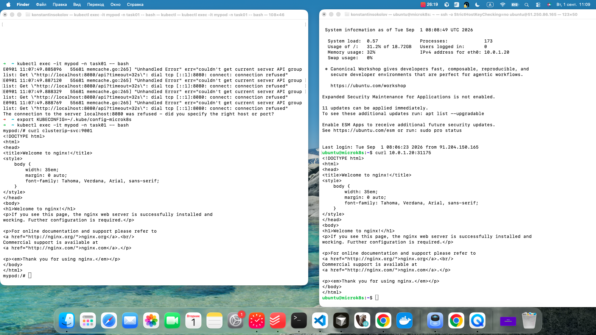

# Домашнее задание к занятию «Сетевое взаимодействие в Kubernetes»

### Примерное время выполнения задания

120 минут

### Цель задания

Научиться настраивать доступ к приложениям в Kubernetes:
- Внутри кластера через **Service** (ClusterIP, NodePort).
- Снаружи кластера через **Ingress**.

Это задание поможет вам освоить базовые принципы сетевого взаимодействия в Kubernetes — ключевого навыка для работы с кластерами.
На практике Service и Ingress используются для доступа к приложениям, балансировки нагрузки и маршрутизации трафика. Понимание этих механизмов поможет вам упростить управление сервисами в рабочих окружениях и снизит риски ошибок при развёртывании.

------

## **Подготовка**
### **Чеклист готовности**
- Установлен Kubernetes (MicroK8S, Minikube или другой).
- Установлен `kubectl`.
- Редактор для YAML-файлов (VS Code, Vim и др.).

------

### Инструменты, которые пригодятся для выполнения задания

1. [Инструкция](https://microk8s.io/docs/getting-started) по установке MicroK8S.
2. [Инструкция](https://minikube.sigs.k8s.io/docs/start/?arch=%2Fwindows%2Fx86-64%2Fstable%2F.exe+download) по установке Minikube. 
3. [Инструкция](https://kubernetes.io/docs/tasks/tools/install-kubectl-windows/)по установке kubectl.
4. [Инструкция](https://marketplace.visualstudio.com/items?itemName=ms-kubernetes-tools.vscode-kubernetes-tools) по установке VS Code

### Дополнительные материалы, которые пригодятся для выполнения задания

1. [Описание](https://kubernetes.io/docs/concepts/workloads/controllers/deployment/) Deployment и примеры манифестов.
2. [Описание](https://kubernetes.io/docs/concepts/services-networking/service/) Описание Service.
3. [Описание](https://kubernetes.io/docs/concepts/services-networking/ingress/) Ingress.
4. [Описание](https://github.com/wbitt/Network-MultiTool) Multitool.

------

## **Задание 1: Настройка Service (ClusterIP и NodePort)**
### **Задача**
Развернуть приложение из двух контейнеров (`nginx` и `multitool`) и обеспечить доступ к ним:
- Внутри кластера через **ClusterIP**.
- Снаружи через **NodePort**.

### **Шаги выполнения**
1. **Создать Deployment** с двумя контейнерами:
   - `nginx` (порт `80`).
   - `multitool` (порт `8080`).
   - Количество реплик: `3`.
2. **Создать Service типа ClusterIP**, который:
   - Открывает `nginx` на порту `9001`.
   - Открывает `multitool` на порту `9002`.
3. **Проверить доступность** изнутри кластера:
```bash
 kubectl run test-pod --image=wbitt/network-multitool --rm -it -- sh
 curl nginx-multitool-svc:9001 # Проверить nginx
 curl nginx-multitool-svc:9002 # Проверить multitool
```
4. **Создать Service типа NodePort** для доступа к `nginx` снаружи.
5. **Проверить доступ** с локального компьютера:
```bash
curl <node-ip>:<node-port>
```

или через браузер.

### **Что сдать на проверку**
- Манифесты:
  - `deployment-multi-container.yaml`
  - `service-clusterip.yaml`
  - `service-nodeport.yaml`
- Скриншоты проверки доступа (`curl` или браузер).

### Решение

```bash
cd task01

kubectl create namespace task01

kubectl apply -f deployment-multi-container.yaml -n task01
# deployment.apps/nginx created

kubectl apply -f service-clusterip.yaml
# service/clusterip-svc created
kubectl apply -f service-nodeport.yaml
# service/nodeport-svc configured

kubectl describe svc clusterip-svc -n task01
Name:                     clusterip-svc
Namespace:                task01
Labels:                   <none>
Annotations:              <none>
Selector:                 app=nginx-multitool
Type:                     ClusterIP
IP Family Policy:         SingleStack
IP Families:              IPv4
IP:                       10.152.183.242
IPs:                      10.152.183.242
Port:                     http  9001/TCP
TargetPort:               80/TCP
Endpoints:                10.1.128.225:80,10.1.128.226:80,10.1.128.227:80
Port:                     multitool  9002/TCP
TargetPort:               8080/TCP
Endpoints:                10.1.128.225:8080,10.1.128.226:8080,10.1.128.227:8080
Session Affinity:         None
Internal Traffic Policy:  Cluster
Events:                   <none>

kubectl describe svc nodeport-svc -n task01
Name:                     nodeport-svc
Namespace:                task01
Labels:                   <none>
Annotations:              <none>
Selector:                 app=nginx-multitool
Type:                     NodePort
IP Family Policy:         SingleStack
IP Families:              IPv4
IP:                       10.152.183.146
IPs:                      10.152.183.146
Port:                     http  80/TCP
TargetPort:               80/TCP
NodePort:                 http  31175/TCP
Endpoints:                10.1.128.226:80,10.1.128.225:80,10.1.128.227:80
Session Affinity:         None
External Traffic Policy:  Cluster
Internal Traffic Policy:  Cluster
Events:                   <none>

kubectl get nodes -o wide
# NAME       STATUS   ROLES    AGE   VERSION   INTERNAL-IP   EXTERNAL-IP   OS-IMAGE             KERNEL-VERSION      CONTAINER-RUNTIME
# microk8s   Ready    <none>   15h   v1.35.6   10.0.1.20     <none>        Ubuntu 24.04.4 LTS   6.8.0-138-generic   containerd://2.1.6

kubectl get svc -n task01
# NAME            TYPE        CLUSTER-IP       EXTERNAL-IP   PORT(S)             AGE
# clusterip-svc   ClusterIP   10.152.183.242   <none>        9001/TCP,9002/TCP   2m32s
# nodeport-svc    NodePort    10.152.183.146   <none>        80:31175/TCP        155m

kubectl apply -f pod.yaml -n task01 
# pod/mypod created

kubectl exec -it mypod -n task01 -- bash
mypod:/# curl clusterip-svc:9001
# <!DOCTYPE html>
# <html>
# <head>
# <title>Welcome to nginx!</title>
# <style>
#     body {
#         width: 35em;
#         margin: 0 auto;
#         font-family: Tahoma, Verdana, Arial, sans-serif;
#     }
# </style>
# </head>
# <body>
# <h1>Welcome to nginx!</h1>
# <p>If you see this page, the nginx web server is successfully installed and
# working. Further configuration is required.</p>

# <p>For online documentation and support please refer to
# <a href="http://nginx.org/">nginx.org</a>.<br/>
# Commercial support is available at
# <a href="http://nginx.com/">nginx.com</a>.</p>

# <p><em>Thank you for using nginx.</em></p>
# </body>
# </html>

curl 51.250.86.165:31175
# <!DOCTYPE html>
# <html>
# <head>
# <title>Welcome to nginx!</title>
# <style>
#     body {
#         width: 35em;
#         margin: 0 auto;
#         font-family: Tahoma, Verdana, Arial, sans-serif;
#     }
# </style>
# </head>
# <body>
# <h1>Welcome to nginx!</h1>
# <p>If you see this page, the nginx web server is successfully installed and
# working. Further configuration is required.</p>

# <p>For online documentation and support please refer to
# <a href="http://nginx.org/">nginx.org</a>.<br/>
# Commercial support is available at
# <a href="http://nginx.com/">nginx.com</a>.</p>

# <p><em>Thank you for using nginx.</em></p>
# </body>
# </html>

# или так
ssh -o StrictHostKeyChecking=no ubuntu@51.250.86.165
ubuntu@microk8s:~$ curl 10.0.1.20:31175
# <!DOCTYPE html>
# <html>
# <head>
# <title>Welcome to nginx!</title>
# <style>
#     body {
#         width: 35em;
#         margin: 0 auto;
#         font-family: Tahoma, Verdana, Arial, sans-serif;
#     }
# </style>
# </head>
# <body>
# <h1>Welcome to nginx!</h1>
# <p>If you see this page, the nginx web server is successfully installed and
# working. Further configuration is required.</p>

# <p>For online documentation and support please refer to
# <a href="http://nginx.org/">nginx.org</a>.<br/>
# Commercial support is available at
# <a href="http://nginx.com/">nginx.com</a>.</p>

# <p><em>Thank you for using nginx.</em></p>
# </body>
# </html>
```

Файлы [тут](./task01/), изображение вот



---
## **Задание 2: Настройка Ingress**
### **Задача**
Развернуть два приложения (`frontend` и `backend`) и обеспечить доступ к ним через **Ingress** по разным путям.

### **Шаги выполнения**
1. **Развернуть два Deployment**:
   - `frontend` (образ `nginx`).
   - `backend` (образ `wbitt/network-multitool`).
2. **Создать Service** для каждого приложения.
3. **Включить Ingress-контроллер**:
```bash
 microk8s enable ingress
   ```
4. **Создать Ingress**, который:
   - Открывает `frontend` по пути `/`.
   - Открывает `backend` по пути `/api`.
5. **Проверить доступность**:
```bash
 curl <host>/
 curl <host>/api
   ```
 или через браузер.

### **Что сдать на проверку**
- Манифесты:
  - `deployment-frontend.yaml`
  - `deployment-backend.yaml`
  - `service-frontend.yaml`
  - `service-backend.yaml`
  - `ingress.yaml`
- Скриншоты проверки доступа (`curl` или браузер).

### Решение

```bash
microk8s enable ingress

kubectl create namespace task02
# namespace/task02 created

kubectl apply -f deployment-backend.yaml
kubectl apply -f deployment-frontend.yaml
kubectl apply -f service-frontend.yaml
kubectl apply -f service-frontend.yaml
kubectl apply -f ingress-frontend.yaml


kubectl get ingress -n task02
NAME             CLASS    HOSTS   ADDRESS   PORTS   AGE
task02-ingress   public   *                 80      11m


curl http://127.0.0.1/
# <!DOCTYPE html>
# <html>
# <head>
# <title>Welcome to nginx!</title>
# <style>
# html { color-scheme: light dark; }
# body { width: 35em; margin: 0 auto;
# font-family: Tahoma, Verdana, Arial, sans-serif; }
# </style>
# </head>
# <body>
# <h1>Welcome to nginx!</h1>
# <p>If you see this page, nginx is successfully installed and working.
# Further configuration is required for the web server, reverse proxy, 
# API gateway, load balancer, content cache, or other features.</p>

# <p>For online documentation and support please refer to
# <a href="https://nginx.org/">nginx.org</a>.<br/>
# To engage with the community please visit
# <a href="https://community.nginx.org/">community.nginx.org</a>.<br/>
# For enterprise grade support, professional services, additional 
# security features and capabilities please refer to
# <a href="https://f5.com/nginx">f5.com/nginx</a>.</p>

# <p><em>Thank you for using nginx.</em></p>
# </body>
# </html>
curl http://127.0.0.1/api
# <html>
# <head><title>404 Not Found</title></head>
# <body>
# <center><h1>404 Not Found</h1></center>
# <hr><center>nginx/1.28.0</center>
# </body>
# </html>
```

---
## Шаблоны манифестов с учебными комментариями
### **1. Deployment (nginx + multitool)**
```yaml
apiVersion: apps/v1
kind: Deployment
metadata:
  name: # ПРИМЕР: "multi-container-app"
spec:
  replicas: # ЗАДАНИЕ: Укажите количество реплик
  selector:
    matchLabels:
      app: # ДОПОЛНИТЕ: Метка для селектора
  template:
    metadata:
      labels:
        app: # ПОВТОРИТЕ метку из selector.matchLabels
    spec:
      containers:
 - name: # ЗАДАНИЕ: Название первого контейнера
        image: nginx
        ports:
 - containerPort: 80
 - name: multitool
        image: wbitt/network-multitool
        ports:
 - containerPort: 8080
        env:
 - name: HTTP_PORT
          value: "8080" # КЛЮЧЕВОЙ МОМЕНТ: Порт должен совпадать с containerPort
```
### **2. Ingress (для frontend и backend)**
```yaml
apiVersion: networking.k8s.io/v1
kind: Ingress
metadata:
  name: # ЗАДАНИЕ: Придумайте имя, допустим example-ingress
  annotations:  # ВАЖНО: Эта аннотация нужна для rewrite правил
    nginx.ingress.kubernetes.io/rewrite-target: /
spec:
  rules:
 - http:
      paths:
 - path: /
        pathType: Prefix
        backend:
          service:
            name: # УКАЖИТЕ: Имя frontend Service
            port:
              number: 80
 - path: /api # КЛЮЧЕВОЙ ПУТЬ: API endpoint
        pathType: Prefix
        backend:
          service:
            name: # УКАЖИТЕ: Имя backend Service
            port:
              number: 80
```
---

## **Правила приёма работы**
1. Домашняя работа оформляется в своём Git-репозитории в файле README.md. Выполненное домашнее задание пришлите ссылкой на .md-файл в вашем репозитории.
2. Файл README.md должен содержать скриншоты вывода необходимых команд `kubectl` и скриншоты результатов.
3. Репозиторий должен содержать тексты манифестов или ссылки на них в файле README.md.

## **Критерии оценивания задания**
1. Зачёт: Все задачи выполнены, манифесты корректны, есть доказательства работы (скриншоты).
2. Доработка (на доработку задание направляется 1 раз): основные задачи выполнены, при этом есть ошибки в манифестах или отсутствуют проверочные скриншоты.
3. Незачёт: работа выполнена не в полном объёме, есть ошибки в манифестах, отсутствуют проверочные скриншоты. Все попытки доработки израсходованы (на доработку работа направляется 1 раз). Этот вид оценки используется крайне редко.

## **Срок выполнения задания**  
1. 5 дней на выполнение задания.
2. 5 дней на доработку задания (в случае направления задания на доработку).